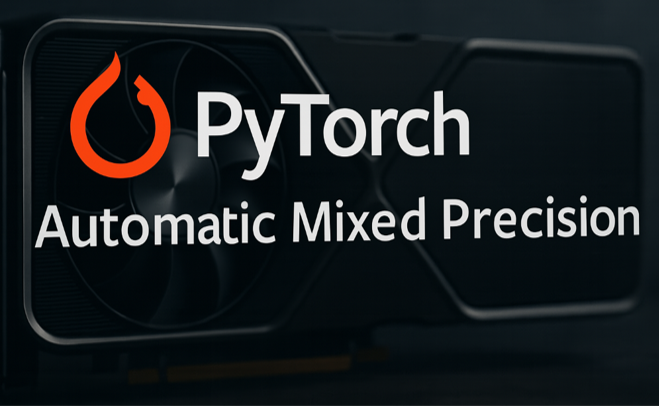
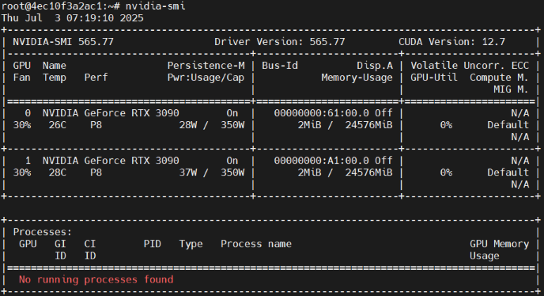
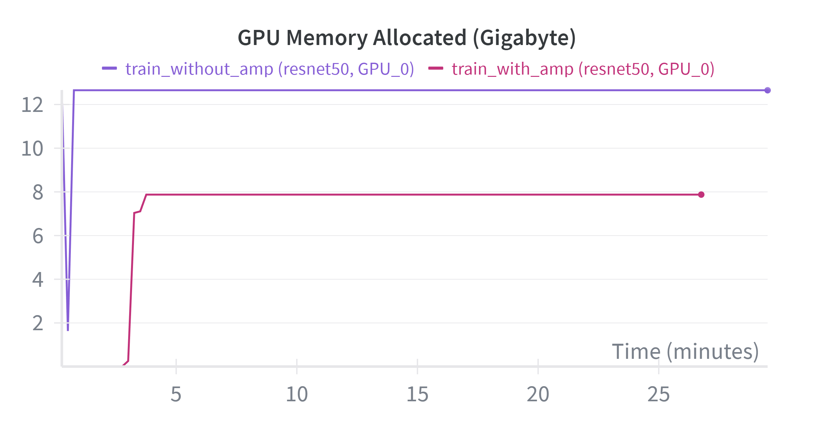

<h1 align="center">
  <br>
  
  <br>
  Tutorial: Comparison between training with and without AMP on an image classification task
  <br>
</h1>

---

<h3 align="center">A wonderful method to reduce GPU memory usage and training time.</h3>

<p align="center">
    
    
    
    
</p>

---
## Motivation

If you're a student or a solo developer like me, you may feel powerless when trying to train an AI model.
Due to limited GPU resources, you might not be able to fine-tune or fully train a model.

This project provides three key features:
1. **Automatic Mixed Precision:**
   A smart and useful technique that allows you to train AI models using fewer GPU resources while maintaining similar accuracy.

2. **RunPod Platform:**  
   A cloud platform that offers various types of GPUs. It's straightforward to launch and manage "Pods," and you only pay for what you use.

3. **Weights & Biases (W&B):**  
   A powerful tool for tracking system states and metrics. (I use it to monitor GPU memory usage in this project.)

Hope this project provides a method to resolve the situation.  
Let's get started!

---

## 📖 Table of Contents
1. [Motivation](#motivation)
2. [Introduction](#introduction)
    * [RunPod](#runpod) 
    * [Environment Configuration](#-environment-configuration)
    * [Install Packages](#-install-packages)
3. [Code Structure](#code-structure)
4. [Usage](#Usage)
5. [Demonstration](#Demonstration)
6. [Reference](#Reference)
7. [A letter to readers](#a-letter-to-readers)

---
## Introduction
### RunPod
In my opinion, RunPod provides a cloud platform with various levels of GPUs for training, deploying, and scaling AI models.

The two most attractive features for me are:
1. it's straightforward to set up your virtual machine. (called "pods.")
2. it's a cost-effective GPU cloud platform where you only pay for what you use.

### 🛠️ Environment Configuration
* Python: 3.8.10
* Compute Type: Nvidia GPU
* GPU Type: RTX 3090 24 GB
* Number of GPU: 2
* Container Image: nvidia/cuda:12.1.0-base-ubuntu22.04
* Container Start Command:
  ```bash
  bash -c 'apt update;DEBIAN_FRONTEND=noninteractive apt-get install openssh-server -y;mkdir -p ~/.ssh;cd $_;chmod 700 ~/.ssh;echo "$PUBLIC_KEY" >> authorized_keys;chmod 700 authorized_keys;service ssh start;sleep infinity'
  ```
* Container Disk: 15 GB
* Volume Disk: 1024 GB
* Volume Mount Path: `/workspace`

#### ❗ **Note:**
1. **Container Disk** is a temporary disk space, which means your files will be removed when you restart the virtual machine. Please make sure the size is large enough for installing libraries.
2. **Volume Disk** is a persistent disk space, which means you can store code projects or virtual environments on it, as the data will not be deleted after restarting.
3. After launching the virtual environment and running the command `nvidia-smi` to check the driver, you will find that the cuda version is `12.7`, not `12.1`. (It seems the image `nvidia/cuda:12.1.0-base-ubuntu22.04` could not be found and was automatically replaced with `cuda:12.7.0`.)

    <p align="center">
       
   </p>  

4. If you want to run this project using **Distributed Data Parallel mode (DDP)**, make sure the selected GPUs support **NVLink**.

>You can know more about RunPod [here](https://www.runpod.io/?pscd=get.runpod.io&ps_partner_key=NDNiMzk4ODE0NWMy&sid=1-g-Cj0KCQjwnJfEBhCzARIsAIMtfKIWE7XPZ-G81MU9JiiBsslMzzOWlYDjHOQYRE3f7eBIp6Ev46bXWwYaAoIBEALw_wcB&gad_source=1&gad_campaignid=22744350165&gbraid=0AAAAA_YlDZ8yVbE9PeZKYayDf2ILRtWIw&gclid=Cj0KCQjwnJfEBhCzARIsAIMtfKIWE7XPZ-G81MU9JiiBsslMzzOWlYDjHOQYRE3f7eBIp6Ev46bXWwYaAoIBEALw_wcB&ps_xid=5LmVinAo5iFUz7&gsxid=5LmVinAo5iFUz7&gspk=NDNiMzk4ODE0NWMy)

### 🛠️ Install Packages

I used Miniconda to manage virtual environments.  
(Click here to know [how to install Miniconda on Ubuntu](https://www.atlantic.net/dedicated-server-hosting/how-to-install-miniconda-on-ubuntu-24-04/))

Once you've created a virtual environment, run the command `pip install -r requirements.txt` to install related libraries.

(Optional) Clean up the cache files under `pip/` to avoid no space error caused by container volume. (`pip cache purge`)

---

## Code Structure
* `assets`: Stores related figures or documents.
* `config`: Stores configuration files in `.yaml` format, such as hyperparameters, optimizer, criterion, and so on.
* `datasets`: A subpackage for reading or downloading datasets. Supports ImageNet and Imagenette.
* `models`: A subpackage for initializing model frameworks and weights, Supports model initialization from `torchvision.models.get_model`.
* `utils`: A subpackage for storing helper functions that are not directly related to the main logic such as defining log format, automatically detecting the device, reading files, and so on.  

#### ❗ **Note: These folders will be created after you run the `train.py`**
* `wandb`: Stores related metadata (if you chose to use `wandb` to record the training process; otherwise it won't appear).
* `weights` Stores the weights for every five epochs and the best weight respectively. (And its structure will be below format.)  
For example, if you set `--wandb_name` to `train_with_amp` and use default value of `--wandb_project`, you will acquire the below structure:  
> pytorch-amp-cnn-pipeline/  
├── assets/   
├── config/  
├── datasets/  
├── models/  
├── utils/  
├── **weights/**  
│   ├── **pytorch-amp-exp/**  (The `--wandb_project` value)  
│   │   ├── **train_with_amp/** (The `--wandb_name` value)  
│   │   │  ├── **{current_time}**/ (The format is `YYYY-MM-DD_HH-MM-SS`)  

---

## Usage
After you clone this repo and have an executable environment, you can run the below command to start training.

### For the multiple GPU environment

* Training with AMP (Set `--nnodes` and `--nproc_per_node` based on your machine)    
`torchrun --nnodes=1 --nproc_per_node=2 -m train --amp --wandb --config config/imagenette.yaml --wandb_name train_with_amp`

* Training without AMP (Set `--nnodes` and `--nproc_per_node` based on your machine)  
`torchrun --nnodes=1 --nproc_per_node=2 -m train --wandb --config config/imagenette.yaml --wandb_name train_without_amp`

### For the single GPU environment

* Training with AMP  
`CUDA_VISIBLE_DEVICES=0 python -m train --amp --wandb --config config/imagenette.yaml --wandb_name train_with_amp"(single GPU)"`

* Training without AMP  
`CUDA_VISIBLE_DEVICES=0 python -m train --wandb --config config/imagenette.yaml --wandb_name train_without_amp"(single GPU)"`
---

## Demonstration

Here are some screenshots of GPU memory usage comparison between training with and without AMP.
(Y-axis: GPU memory usage (GB), X-axis: Training time (minutes)) 

As you can see, training with AMP can reduce the GPU memory usage by approximately 38% (from 12.67 GB to 7.87 GB)

<p align="center">
    
</p>

<p align="center">
    
</p>

---

## Reference

During the development of this project, I referred to the following resources:

### Training framework:
* [Training with Pytorch](https://docs.pytorch.org/tutorials/beginner/introyt/trainingyt.html)
* [Automatic Mixed Precision Example](https://docs.pytorch.org/docs/stable/notes/amp_examples.html)

### Pytorch DDP Concepts and Implementation:
* [Pytorch 分散式訓練 DistributedDataParallel — 實作篇](https://medium.com/ching-i/pytorch-%E5%88%86%E6%95%A3%E5%BC%8F%E8%A8%93%E7%B7%B4-distributeddataparallel-%E5%AF%A6%E4%BD%9C%E7%AF%87-35c762cb7e08)
* [Be careful to use 'dist.barrier()'](https://murphypei.github.io/blog/2021/05/torch-barrier-trap)

Hope these resources can help you to understand the concepts and implementation of DDP.

---

## A letter to readers

Dear readers:  

I hope you can find this project helpful.  
If you have any questions or suggestions, please feel free to open an issue or contact me directly.

I encourage you to explore more about the PyTorch framework and the RunPod platform.  
Dive into the code, trace its logic, and reflect on it.  
By doing so, you'll develop your own design thinking for future projects—**and I believe you’ll find inspiration along the way.**

See you in the next project!
Sincerely,  
Sheng-Wen, Wang

---
## License

This project is licensed under the terms of the **MIT** license.
>You can check out the full license [here](https://github.com/shengwen8785/pytorch-amp-cnn-pipeline/blob/main/LICENSE)
